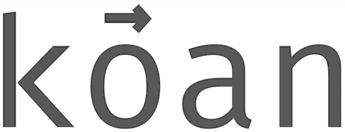

<p align="center"></p>

> ... the Zen attitude is that words and truth are incompatible, or at least that no words can capture truth.
> 
> Douglas R. Hofstadter

A word2vec negative sampling implementation with correct CBOW update. kōan only depends on Eigen.

_Authors_: Ozan Irsoy, Adrian Benton, Karl Stratos

Thanks to Cyril Khazan for helping kōan better scale to many threads.

## Menu

- [Rationale](#rationale)
- [Building](#building)
- [Quick start](#quick-start)
- [Installation](#installation)
- [License](#license)

## Rationale

Although continuous bag of word (CBOW) embeddings can be trained more quickly than skipgram (SG) embeddings, it is a common belief that SG embeddings tend to perform better in practice. This was observed by the original authors of Word2Vec [1] and also in subsequent work [2].  However, we found that popular implementations of word2vec with negative sampling such as [word2vec](https://github.com/tmikolov/word2vec/) and [gensim](https://github.com/RaRe-Technologies/gensim/) do not implement the CBOW update correctly, thus potentially leading to misconceptions about the performance of CBOW embeddings when trained correctly.

We release kōan so that others can efficiently train CBOW embeddings using the corrected weight update. See this [technical report](https://arxiv.org/abs/2012.15332) for benchmarks of kōan vs. gensim word2vec negative sampling implementations.  If you use kōan to learn word embeddings for your own work, please cite:

> Ozan İrsoy, Adrian Benton, and Karl Stratos. "kōan: A Corrected CBOW Implementation." arXiv preprint __arXiv:2012.15332__ (__2020__).

[1] Tomas Mikolov, Ilya Sutskever, Kai Chen, Greg S Corrado, and Jeff Dean. Distributed representations of words and phrases and their compositionality. In Advances in neural information processing systems, pages 3111–3119, 2013.

[2] Karl Stratos, Michael Collins, and Daniel Hsu. Model-based word embeddings from decompositions of count matrices. In Proceedings of the 53rd Annual Meeting of the Association for Computational Linguistics and the 7th International Joint Conference on Natural Language Processing
(Volume 1: Long Papers), pages 1282–1291, 2015.

## Building

You need a C++17 supporting compiler to build koan (tested with g++ 7.5.0, 8.4.0, 9.3.0, and clang 11.0.3).

To build koan and all tests:
```
mkdir build
cd build
cmake ..
cmake --build ./
```

Run tests with (assuming you are still under `build`):
```
./test_gradcheck
./test_utils
```

## Installation

Installation is as simple as placing the koan binary on your `PATH`
(you might need sudo):

```
cmake --install ./
```

## Quick Start

To train word embeddings on [Wikitext-2](https://blog.einstein.ai/the-wikitext-long-term-dependency-language-modeling-dataset/), first clone and build koan:

```
git clone --recursive git@github.com:bloomberg/koan.git
cd koan
mkdir build
cd build
cmake .. && cmake --build ./
cd ..
```

Download and unzip the Wikitext-2 corpus:

```
curl https://s3.amazonaws.com/research.metamind.io/wikitext/wikitext-2-v1.zip --output wikitext-2-v1.zip
unzip wikitext-2-v1.zip
head -n 5 ./wikitext-2/wiki.train.tokens
```

And learn CBOW embeddings on the training fold with:

```
./build/koan -V 2000000 \
             --epochs 10 \
             --dim 300 \
             --negatives 5 \
             --context-size 5 \
             -l 0.075 \
             --threads 16 \
             --cbow true \
             --min-count 2 \
             --file ./wikitext-2/wiki.train.tokens
```

or skipgram embeddings by running with `--cbow false`. `./build/koan --help` for a full list of command-line arguments and descriptions.  Learned embeddings will be saved to `embeddings_${CURRENT_TIMESTAMP}.txt` in the present working directory.

## License

Please read the [LICENSE](LICENSE) file.
